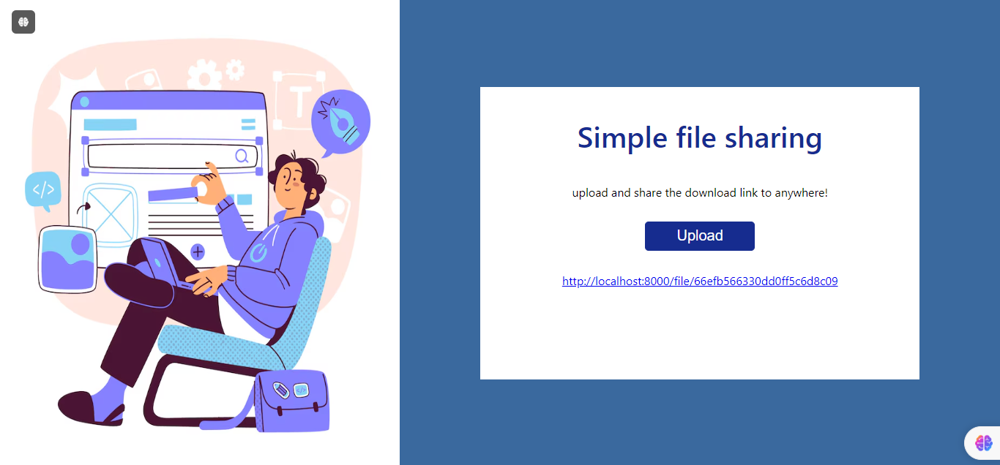

 # Share Media - File Sharing System

## Project Overview

**Share Media** is a simple yet powerful file-sharing system that allows users to upload images and generate a unique download link. This link can be shared with anyone, allowing them to download the uploaded image from anywhere in the world.

Whether you're sharing personal photos, work-related images, or media files, Share Media provides a quick and efficient way to make your files accessible to others.

### Key Features:
- **Image Uploading:** Users can easily upload their images to the platform.
- **Link Generation:** Each uploaded file generates a unique URL that can be shared for downloading.
- **Global Access:** The download link can be accessed and used anywhere with internet connectivity.
- **Simple UI:** Clean and user-friendly interface for ease of use.

---

## Tech Stack

Share Media was built using the following technologies:

- **Frontend:** 
  - React(for the user interface and interaction)

- **Backend:** 
  - Node.js with Express.js (for managing the server and APIs)
  - Multer (for handling file uploads)
  - Cloudinary/AWS S3/Local Storage (for image storage)(*to be integrated later)

- **Database:**
  - MongoDB (for storing metadata about the uploaded images and their links)
  

---
